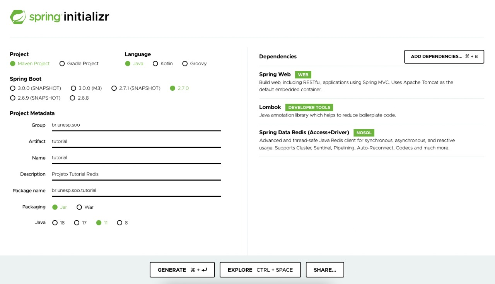

# Redis com Spring Boot

- [Redis com Spring Boot](#redis-com-spring-boot)
- [Requisitos](#requisitos)
    * [O que é Redis?](#o-que---redis-)
- [Redis na prática](#redis-na-pr-tica)
    * [Criando as classes do projeto](#criando-as-classes-do-projeto)
        + [News](#news)
        + [NewsController](#newscontroller)
        + [NewsRepository](#newsrepository)
    * [Como integrar o Redis com Spring](#como-integrar-o-redis-com-spring)
        + [Iniciar instância Redis local](#iniciar-inst-ncia-redis-local)
        + [Parâmetros de acesso](#par-metros-de-acesso)
        + [Configuração na aplicação](#configura--o-na-aplica--o)
        + [Ativar cache em método](#ativar-cache-em-m-todo)
    * [Rodando o tutorial](#rodando-o-tutorial)

# Requisitos
- Conhecimento básico em Spring Boot e Java
- Docker instalado na máquina (Veja como fazer o download: https://docs.docker.com/get-docker/)

## O que é Redis?

Redis é um armazenamento de estrutura de dados que pode ser utilizado como banco de dados, cache, broker de mensageria e
motor de streaming.

Redis provê escrita e leitura atômica de estruturas de dados como listas, conjuntos, maps, strings e outras. Além disso, possui replicação nativa,
execução de script em Lua, políticas de limpeza de cache, transações, persistência e alta disponibilidade com Redis
Sentinel e particionamento automático com Redis Cluster.

# Redis na prática
Para praticar o Redis, vamos criar uma aplicação Spring Boot, utilizando [Spring Initializr](https://start.spring.io/),
conforme a imagem abaixo:



## Criando as classes do projeto
Para esse tutorial, iremos exemplificar com um método de listagem de notícias para uma página principal em que o conteúdo é estático e deve ser reconstruído a cada 2 minutos.
Como o conteúdo é estático, não precisamos obter as mesmas notícias para casa usuário. Se fizéssemos isso, poderíamos onerar o banco de dados desnecessariamente, uma vez que podemos salvar esses dados em cache.

Nossa estrutura de classes ficará:
```
├── controller
│   └── NewsController.java
├── entities
│   └── News.java
├── repository
│   └── NewsRepository.java
├── RedisTutorialApplication.java
```

- A classe `News` é uma classe modelo de como uma notícia é estruturada.
- A classe `NewsRepository` é a classe que faz a obtenção dos dados das notícias na fonte lenta.
- A classe `NewsController` ficará responsável por expor os dados por HTTP.
- A classe `RedisTutorialApplication` é a classe principal que executará o framework.

### News
```java
@Getter
@Builder
@Jacksonized
public class News {
    private final String title;
    private final String content;
    private final String author;
}
```

### NewsController
```java
@RestController
@RequestMapping("/news")
@RequiredArgsConstructor
public class NewsController {

    private final NewsRepository newsRepository;

    @GetMapping
    public List<News> findAll() {
        return newsRepository.findAll();
    }

}
```
### NewsRepository
Para simular uma consulta lenta, teremos um `Thread.sleep()` de 4 segundos no método `findAll()`.

Adicionaremos um banco de dados fake apenas para simular a obtenção de dados, com a biblioteca Faker.

```java
@Component
public class NewsRepository {
private final Faker FAKER = new Faker();
private final List<News> DATABASE = new ArrayList<>();
private static final int NEWS_DB_SIZE = 100;

    @PostConstruct
    public void setup() {
        for (int index = 0; index < NEWS_DB_SIZE; index++) {
            DATABASE.add(News.builder()
                    .author(FAKER.name().fullName())
                    .title(FAKER.lorem().characters(10, 20))
                    .content(FAKER.lorem().characters(1000, 10_000))
                    .build());
        }
    }

    public List<News> findAll() {
        try {
            Thread.sleep(4000);
        } catch (InterruptedException e) {
            e.printStackTrace();
        }
        return DATABASE;
    }
}
```
## Como integrar o Redis com Spring
No arquivo `pom.xml`, é possível integrar com o Redis através de bibliotecas criadas para o ecossistema Spring Boot:

```xml
<dependency>
    <groupId>org.springframework.boot</groupId>
    <artifactId>spring-boot-starter-data-redis</artifactId>
    <version>2.7.0</version>
</dependency>
```

Com essa biblioteca, poderemos conectar com a instância Redis. Para tanto, precisamos iniciar a instância e configurar os parâmetros de acesso, serialização e cache eviction.

### Iniciar instância Redis local
Para iniciar o Redis na máquina local, utilizaremos Docker.

Faça download da imagem do Redis:
```bash
$ docker pull redis:7.0.0
```

Inicie um container:
```bash
$ docker run -d -p 6379:6379 --name redis-tutorial-local redis:7.0.0
```

Podemos testar a conectividade através do comando `telnet`
```bash
$ telnet localhost 6379
```

### Parâmetros de acesso
Para definir o hostname e porta, adicionaremos as seguintes linhas no arquivo `application.properties`:
```properties
spring.redis.host=localhost
spring.redis.port=6379
```

### Configuração na aplicação
Para configurar a serialização e limpeza de cache, criaremos um pacote `config` e a classe `RedisConfiguration.java`:

```java
@Slf4j
@Configuration
@EnableCaching
@EnableScheduling
public class RedisConfiguration {
    public static final String NEWS_KEY = "news";

    @CacheEvict(allEntries = true, value = NEWS_KEY)
    @Scheduled(fixedDelayString = "${cache.ttl.ms}")
    public void evictCache() {
        log.info("Cache cleared");
    }

    @Bean
    public RedisCacheConfiguration cacheConfiguration() {
        return RedisCacheConfiguration.defaultCacheConfig()
                .disableCachingNullValues()
                .serializeValuesWith(RedisSerializationContext.SerializationPair.fromSerializer(new GenericJackson2JsonRedisSerializer()));
    }
}
```

Note que a classe contém um *Bean* de configuração para desabilitar cache de valores nulos e para serializar objetos Java em JSON utilizando uma classe utilitária.

Além disso, é utilizado a anotação `@EnableCaching` na declaração da classe para habilitar o uso de cache na aplicação Spring.

Com o uso da anotação `@EnableScheduling`, é possível limpar o cache num intervalo de tempo definido no `application.properties`:
```properties
cache.ttl.ms=120000
```
Com essa configuração, o cache será limpo a cada 2 minutos.

### Ativar cache em método
Como visto anteriormente, na classe NewsRepository, simulamos uma lentidão de busca no banco de dados com `Thread.sleep(4000)` que faz com que o endpoint responda no mínimo com 4 segundos de tempo de resposta.

```java
public class NewsRepository {
    private final List<News> DATABASE = ArrayList<>;
    
    public List<News> findAll() {
        try {
            Thread.sleep(4000);
        } catch (InterruptedException ignored) {
        }
        
        return DATABASE;
    }
}
```

Se testarmos uma chamada na API que busca esses dados, temos o seguinte resultado:
```bash
$ curl -o /dev/null -s -w 'Total: %{time_total}s\n' localhost:8080/news
Total: 4.136567s
```

Se adicionarmos a anotação `@Cacheable(value = NEWS_KEY)` na assinatura do método
````java
@Cacheable(value = NEWS_KEY)
public List<News> findAll() { ... }
````

Temos o seguinte resultado:
```bash
$ curl -o /dev/null -s -w 'Total: %{time_total}s\n' localhost:8080/news
Total: 4.159841s

$ curl -o /dev/null -s -w 'Total: %{time_total}s\n' localhost:8080/news
Total: 0.110986s

$ curl -o /dev/null -s -w 'Total: %{time_total}s\n' localhost:8080/news
Total: 0.093111s
```
Perceba que na primeira execução, não existia o valor em memória cache, então a aplicação precisou obter o valor da fonte original, que em nosso caso é lenta.
Nas próximas execuções, já obteve o valor da memória Redis, reduzindo drasticamente o tempo de resposta.
Conseguimos reduzir de 4150 ms para 110ms, redução de aproximadamente 38 vezes do tempo de resposta.

O que de fato está acontecendo, é que a aplicação está validando se o dado existe no Redis, e se existir, retorna imediatamente. Caso não exista, ele obterá da fonte original lenta e salvará no Redis para processamentos futuros.


## Rodando o tutorial

Rode a aplicação e a instância Redis com o comando e teste em sua máquina o que foi comentado nesse tutorial:

```bash
$ docker-compose up -d
```

Acesse pela rota http://localhost:8080/news
